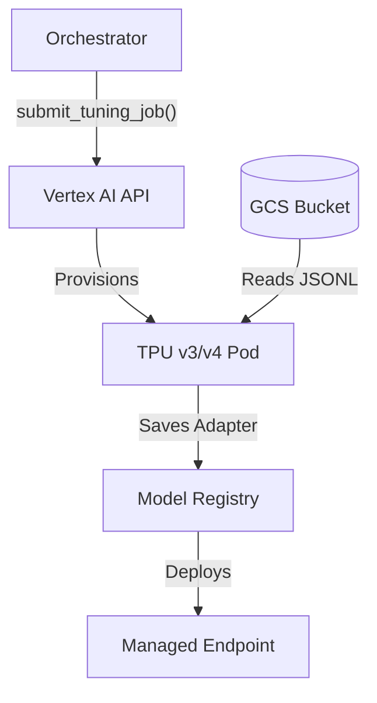
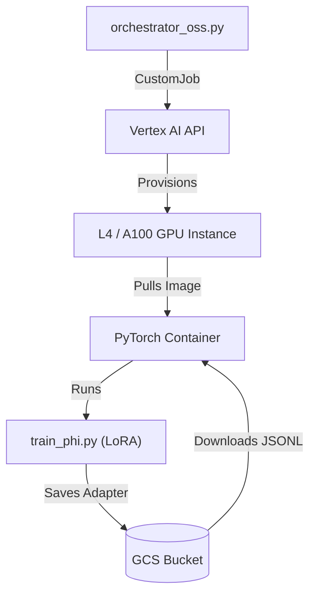

# System Architecture: Childcare Observation Classification

This document details the technical architecture, fine-tuning methodology, and execution flow of the solution.

## 1. High-Level Architecture

The solution supports two distinct pipelines: **Managed Gemini Tuning** and **OSS Custom Tuning**.

### Pipeline A: Managed Gemini (Primary)
Uses Vertex AI's managed tuning service for Gemini models (JAX/TPU).

### Pipeline B: OSS Custom Tuning (Phi-3 / Llama)
Uses Vertex AI **Custom Jobs** to run a PyTorch container on GPU instances.

### Components

1.  **Data Transformation Layer** (`src/`): Runs locally or in a CI/CD environment. It parses raw historical data, validates it against the `learningdomains.json` taxonomy, and converts it into the JSONL format required by Gemini.
2.  **Storage Layer** (GCS): Acts as the bridge between the local environment and the managed Vertex AI infrastructure. Holds training data and model artifacts.
3.  **Compute Layer** (Vertex AI):
    *   **Tuning**: Managed TPU/GPU clusters that execute the training.
    *   **Serving**: Managed endpoint nodes that host the model for real-time inference.

---

## 2. Fine-Tuning Methodology

We typically use **Parameter-Efficient Fine-Tuning (PEFT)**, specifically **Low-Rank Adaptation (LoRA)**, rather than "Full Fine-Tuning".

### Why LoRA?
*   **Efficiency**: Instead of retraining all billions of parameters in Gemini 1.5 Flash (Full Fine-Tuning), LoRA freezes the pre-trained model weights and injects trainable rank decomposition matrices (adapters) into each layer of the Transformer architecture.
*   **Performance**: It achieves comparable performance to full fine-tuning for domain adaptation tasks while requiring significantly less compute and memory.
*   **Cost**: Because only a tiny fraction of weights are updated, training is faster and cheaper.
*   **Preventing Catastrophic Forgetting**: The underlying general knowledge of Gemini (reasoning, vision) is preserved because its core weights are untouched.

### Model Details
*   **Base Model**: `gemini-1.5-flash-002` (Multimodal)
*   **Framework**: **JAX** (Not PyTorch). Gemini models are trained and tuned on Google's JAX framework optimized for TPU pods. This offers massive throughput advantages over standard GPU/PyTorch setups for these specific models.
*   **Hyperparameters**:
    *   `epochs`: 4 (Number of complete passes through the dataset)
    *   `adapter_size`: 4 (Rank of the LoRA matrices; higher means more capacity but more overfitting risk)
    *   `learning_rate_multiplier`: 1.0 (Controls how fast the adapter weights typically change)

---

## 3. Libraries & Dependencies

The solution relies on the Google Cloud Python ecosystem:

| Library | Role | Usage |
| :--- | :--- | :--- |
| `google-cloud-aiplatform` | Core SDK | Manages all Vertex AI interactions (Job submission, Model deployment, Endpoint prediction). |
| `vertexai` | GenAI Specifics | Provides specific classes for Generative AI tuning and inference (`GenerativeModel`, `sft`). |
| `pandas` | Data Processing | Used implicitly for structured data manipulation during analysis. |
| `scikit-learn` | Evaluation | Calculates metrics like Accuracy, F1-Score, and Confusion Matrices. |

---

## 4. Execution Flow: What Happens When You Run `tuning_orchestrator.py`?

When you execute `python scripts/tuning_orchestrator.py --start`, the following sequence occurs:

### Phase 1: Initialization & Validation
1.  **Auth**: The script uses your local gcloud credentials (`~/.config/gcloud/...`) to authenticate with GCP.
2.  **Config Load**: It reads `config.py` to get the Project ID, Region, and Model configurations.

### Phase 2: Data Upload
3.  **Hashing/Versioning**: (Optional) It checks if data has changed.
4.  **Upload**: It uploads your local `data/training/train.jsonl` and `valid.jsonl` files to the GCS bucket defined in `config.py`.
    *   *Path*: `gs://<bucket_name>/training-data/<timestamp>/train.jsonl`

### Phase 3: Job Submission
5.  **API Call**: The script constructs a `SupervisedTuningJob` request object using the Vertex AI SDK.
6.  **Submission**: It sends this request to the Vertex AI API endpoint in your region.
7.  **Resource Allocation**: Google's control plane receives the request and provisions the necessary compute resources (e.g., TPU v3/v4 pods) from their internal pool. **This is why you don't need a GPU on your Mac.**

### Phase 4: Managed Training (The "Black Box")
8.  **Data Ingestion**: The provisioned TPUs read the JSONL files directly from your GCS bucket.
9.  **Training Loop**: The system runs the LoRA training loop for the specified number of epochs.
10. **Validation**: At the end of each epoch, it evaluates performance against `valid.jsonl` (if provided) to track loss.

### Phase 5: Artifact Registration
11. **Completion**: Once training finishes, the TPUs are spun down (billing stops).
12. **Registry**: The resulting "Adapter" weights are saved to the Vertex AI Model Registry as a new Model resource.
13. **Notification**: The script (if polling) detects the "SUCCEEDED" status and reports the new `model_resource_name` (e.g., `projects/123.../models/456...`).

You are now ready to deploy this `model_resource_name` to an endpoint!

---

## 5. Execution Alternatives: Local Scripts vs. Vertex AI Workbench

You can run the `tuning_orchestrator.py` script locally or inside a managed Jupyter Notebook (Vertex AI Workbench).

| Feature | **Local Scripts (Recommended)** | **Vertex AI Workbench (Jupyter)** |
| :--- | :--- | :--- |
| **Cost** | **Lower**. You only pay for the tuning job itself. The "orchestrator" runs for free on your machine. | **Higher**. You pay for the Notebook instance (VM) uptime while you work ($0.20-$1.00/hr) + the tuning job. |
| **Performance** | **Identical**. The actual fine-tuning runs on managed Google Cloud TPUs in both cases. The client machine just sends the API request. | **Identical**. The Notebook VM is not used for training, only for submitting the request. |
| **Workflow** | **DevOps Friendly**. Easier to version control (Git), integrate into CI/CD, and automate. | **Interactive**. Better for visualizing data distributions or debugging complex logic interactively. |
| **Setup** | Requires local Python environment and gcloud auth. | Zero setup (environments come pre-installed). |

**Verdict**: Use **Local Scripts** for the repeatable training pipeline to save costs. Use **Notebooks** only if you need to perform heavy interactive data analysis on the raw images before training.
