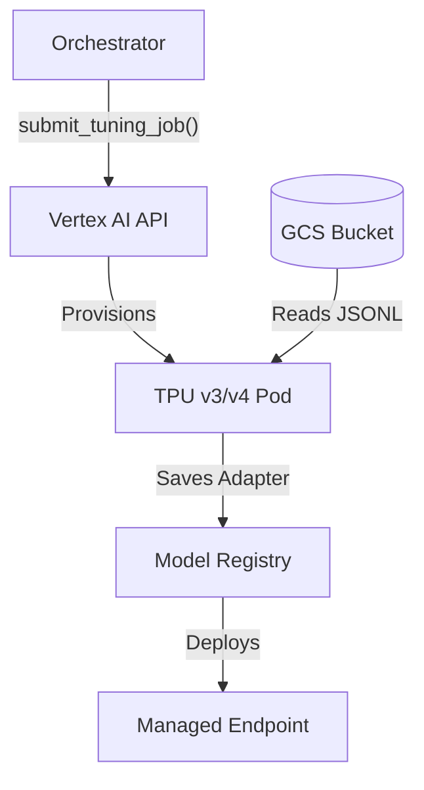
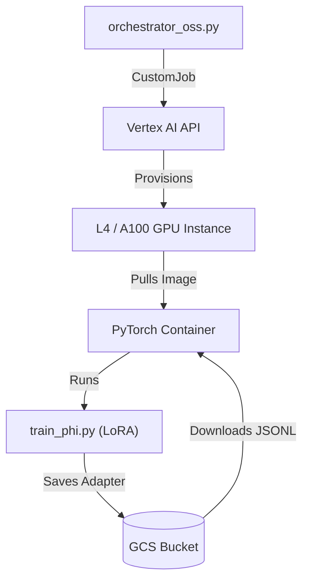

# System Architecture: Childcare Observation Classification

This document details the technical architecture, fine-tuning methodology, execution flow, design patterns, frameworks, and tools used in the solution.

## 1. High-Level Architecture

The solution supports two distinct pipelines: **Managed Gemini Tuning** and **OSS Custom Tuning**.

### Pipeline A: Managed Gemini (Primary)
Uses Vertex AI's managed tuning service for Gemini models (JAX/TPU).



### Pipeline B: OSS Custom Tuning (Phi-3 / Llama)
Uses Vertex AI **Custom Jobs** to run a PyTorch container on GPU instances.



### Components

1.  **Data Transformation Layer** (`src/`): Runs locally or in a CI/CD environment. It parses raw historical data, validates it against the `learningdomains.json` taxonomy, and converts it into the JSONL format required by Gemini.
2.  **Storage Layer** (GCS): Acts as the bridge between the local environment and the managed Vertex AI infrastructure. Holds training data and model artifacts.
3.  **Compute Layer** (Vertex AI):
    *   **Tuning**: Managed TPU/GPU clusters that execute the training.
    *   **Serving**: Managed endpoint nodes that host the model for real-time inference.

---

## 2. Fine-Tuning Methodology

We typically use **Parameter-Efficient Fine-Tuning (PEFT)**, specifically **Low-Rank Adaptation (LoRA)**, rather than "Full Fine-Tuning".

### Why LoRA?
*   **Efficiency**: Instead of retraining all billions of parameters in Gemini 1.5 Flash (Full Fine-Tuning), LoRA freezes the pre-trained model weights and injects trainable rank decomposition matrices (adapters) into each layer of the Transformer architecture.
*   **Performance**: It achieves comparable performance to full fine-tuning for domain adaptation tasks while requiring significantly less compute and memory.
*   **Cost**: Because only a tiny fraction of weights are updated, training is faster and cheaper.
*   **Preventing Catastrophic Forgetting**: The underlying general knowledge of Gemini (reasoning, vision) is preserved because its core weights are untouched.

### Model Details
*   **Base Model**: `gemini-1.5-flash-002` (Multimodal)
*   **Framework**: **JAX** (Not PyTorch). Gemini models are trained and tuned on Google's JAX framework optimized for TPU pods. This offers massive throughput advantages over standard GPU/PyTorch setups for these specific models.
*   **Hyperparameters**:
    *   `epochs`: 4 (Number of complete passes through the dataset)
    *   `adapter_size`: 4 (Rank of the LoRA matrices; higher means more capacity but more overfitting risk)
    *   `learning_rate_multiplier`: 1.0 (Controls how fast the adapter weights typically change)

---

## 3. Libraries & Dependencies

The solution relies on the Google Cloud Python ecosystem:

| Library | Role | Usage |
| :--- | :--- | :--- |
| `google-cloud-aiplatform` | Core SDK | Manages all Vertex AI interactions (Job submission, Model deployment, Endpoint prediction). |
| `vertexai` | GenAI Specifics | Provides specific classes for Generative AI tuning and inference (`GenerativeModel`, `sft`). |
| `pandas` | Data Processing | Used implicitly for structured data manipulation during analysis. |
| `scikit-learn` | Evaluation | Calculates metrics like Accuracy, F1-Score, and Confusion Matrices. |

---

## 4. Execution Flow: What Happens When You Run `tuning_orchestrator.py`?

When you execute `python scripts/tuning_orchestrator.py --start`, the following sequence occurs:

### Phase 1: Initialization & Validation
1.  **Auth**: The script uses your local gcloud credentials (`~/.config/gcloud/...`) to authenticate with GCP.
2.  **Config Load**: It reads `config.py` to get the Project ID, Region, and Model configurations.

### Phase 2: Data Upload
3.  **Hashing/Versioning**: (Optional) It checks if data has changed.
4.  **Upload**: It uploads your local `data/training/train.jsonl` and `valid.jsonl` files to the GCS bucket defined in `config.py`.
    *   *Path*: `gs://<bucket_name>/training-data/<timestamp>/train.jsonl`

### Phase 3: Job Submission
5.  **API Call**: The script constructs a `SupervisedTuningJob` request object using the Vertex AI SDK.
6.  **Submission**: It sends this request to the Vertex AI API endpoint in your region.
7.  **Resource Allocation**: Google's control plane receives the request and provisions the necessary compute resources (e.g., TPU v3/v4 pods) from their internal pool. **This is why you don't need a GPU on your Mac.**

### Phase 4: Managed Training (The "Black Box")
8.  **Data Ingestion**: The provisioned TPUs read the JSONL files directly from your GCS bucket.
9.  **Training Loop**: The system runs the LoRA training loop for the specified number of epochs.
10. **Validation**: At the end of each epoch, it evaluates performance against `valid.jsonl` (if provided) to track loss.

### Phase 5: Artifact Registration
11. **Completion**: Once training finishes, the TPUs are spun down (billing stops).
12. **Registry**: The resulting "Adapter" weights are saved to the Vertex AI Model Registry as a new Model resource.
13. **Notification**: The script (if polling) detects the "SUCCEEDED" status and reports the new `model_resource_name` (e.g., `projects/123.../models/456...`).

You are now ready to deploy this `model_resource_name` to an endpoint!

---

## 5. Execution Alternatives: Local Scripts vs. Vertex AI Workbench

You can run the `tuning_orchestrator.py` script locally or inside a managed Jupyter Notebook (Vertex AI Workbench).

| Feature | **Local Scripts (Recommended)** | **Vertex AI Workbench (Jupyter)** |
| :--- | :--- | :--- |
| **Cost** | **Lower**. You only pay for the tuning job itself. The "orchestrator" runs for free on your machine. | **Higher**. You pay for the Notebook instance (VM) uptime while you work ($0.20-$1.00/hr) + the tuning job. |
| **Performance** | **Identical**. The actual fine-tuning runs on managed Google Cloud TPUs in both cases. The client machine just sends the API request. | **Identical**. The Notebook VM is not used for training, only for submitting the request. |
| **Workflow** | **DevOps Friendly**. Easier to version control (Git), integrate into CI/CD, and automate. | **Interactive**. Better for visualizing data distributions or debugging complex logic interactively. |
| **Setup** | Requires local Python environment and gcloud auth. | Zero setup (environments come pre-installed). |

**Verdict**: Use **Local Scripts** for the repeatable training pipeline to save costs. Use **Notebooks** only if you need to perform heavy interactive data analysis on the raw images before training.

---

## 6. Design Patterns & Architectural Principles

### 6.1 Configuration Management Pattern

**Pattern**: Centralized Configuration with Environment Variable Override

The project uses a **dataclass-based configuration pattern** (`config.py`) that provides:
- **Type Safety**: Dataclasses ensure type correctness at development time
- **Environment Variable Support**: Override defaults via `os.getenv()`
- **Validation**: Built-in `validate_config()` function checks for common misconfigurations
- **Separation of Concerns**: Separate config classes for GCP, Model, Data, and Evaluation

```python
@dataclass
class GCPConfig:
    project_id: str = os.getenv("GCP_PROJECT_ID", "your-gcp-project-id")
    region: str = os.getenv("GCP_REGION", "us-central1")
    # ... more fields
```

**Benefits**:
- Single source of truth for configuration
- Easy to test with different configurations
- Supports both development and production environments

### 6.2 Data Transformation Pipeline Pattern

**Pattern**: ETL (Extract, Transform, Load) with Validation

The data pipeline follows a **multi-stage transformation pattern**:

1. **Extract** (`observation_transformer.py`): Reads raw observation data
2. **Transform** (`observation_transformer.py`): Validates and normalizes to canonical format
3. **Load** (`dataset_builder.py`): Converts to training-ready JSONL format

**Key Features**:
- **Canonical Data Model**: `CanonicalObservation` dataclass ensures consistent structure
- **Taxonomy Validation**: Validates against `learningdomains.json` before processing
- **Idempotent Operations**: Can be safely re-run without side effects
- **Error Handling**: Graceful handling of malformed data with detailed error messages

### 6.3 Repository Pattern (Storage Abstraction)

**Pattern**: Abstract Storage Layer

While not explicitly implemented as interfaces, the codebase uses **GCS as the storage abstraction layer**:

- **Local Development**: Files can be read/written locally
- **Cloud Execution**: Same code paths work with GCS URIs (`gs://bucket/path`)
- **Vertex AI Integration**: Training jobs read directly from GCS without local copies

**Benefits**:
- Decouples data location from processing logic
- Enables seamless transition from local to cloud execution
- Supports distributed training scenarios

### 6.4 Orchestrator Pattern

**Pattern**: Command Pattern with Job Tracking

The orchestrator scripts (`tuning_orchestrator.py`, `tuning_orchestrator_oss.py`) implement an **orchestrator pattern**:

- **Job Submission**: Encapsulates complex Vertex AI API calls
- **State Management**: Tracks job status in `tuning_jobs.json`
- **Polling Mechanism**: Monitors long-running async operations
- **Error Recovery**: Handles transient failures and retries

**Command Structure**:
```bash
python scripts/tuning_orchestrator.py --start    # Submit job
python scripts/tuning_orchestrator.py --status   # Check status
python scripts/tuning_orchestrator.py --list     # List all jobs
```

### 6.5 Client SDK Pattern

**Pattern**: Facade Pattern for Complex API

The `inference_client.py` implements a **facade pattern** that:
- **Simplifies API**: Hides Vertex AI endpoint complexity behind simple methods
- **Type Safety**: Returns structured `ClassificationResult` objects
- **Error Handling**: Converts API errors to user-friendly exceptions
- **Retry Logic**: Handles transient network failures automatically

**Usage**:
```python
classifier = ObservationClassifier(project_id="...", location="...")
result = classifier.classify(notes="...", image_uri="gs://...")
# Returns ClassificationResult with typed fields
```

### 6.6 Factory Pattern (Model Selection)

**Pattern**: Strategy Pattern for Model Selection

The system supports multiple model types through **configuration-driven selection**:

- **Gemini Models**: Managed via Vertex AI SDK (`GenerativeModel`)
- **OSS Models**: Custom training containers (`train_phi.py`)
- **Unified Interface**: Same orchestrator pattern for both (different implementations)

**Benefits**:
- Easy to add new model types
- Consistent interface regardless of underlying model
- A/B testing capabilities

### 6.7 Dependency Injection

**Pattern**: Constructor Injection

Components receive dependencies via constructor parameters:

```python
def __init__(
    self,
    project_id: Optional[str] = None,
    location: Optional[str] = None,
    # ... other dependencies
):
    self.project_id = project_id or (gcp_config.project_id if gcp_config else None)
```

**Benefits**:
- Testable: Can inject mock dependencies
- Flexible: Supports different configurations per instance
- Clear dependencies: Makes required vs. optional dependencies explicit

---

## 7. Frameworks & Libraries Deep Dive

### 7.1 Google Cloud Vertex AI

**Framework**: `google-cloud-aiplatform` (v1.38.0+)

**Purpose**: Managed ML infrastructure and services

**Key Components Used**:

1. **Supervised Fine-Tuning (SFT)**
   - `vertexai.tuning.sft`: Managed fine-tuning for Gemini models
   - Handles TPU provisioning, data loading, training loop, checkpointing
   - Returns tuned model resource names for deployment

2. **Custom Training Jobs**
   - `aiplatform.CustomJob`: For OSS model training
   - Supports custom Docker containers
   - GPU instance management (L4, A100)

3. **Model Registry**
   - `aiplatform.Model`: Versioned model storage
   - Metadata tracking (training config, metrics, lineage)

4. **Endpoints**
   - `aiplatform.Endpoint`: Managed model serving
   - Auto-scaling, load balancing, monitoring
   - Supports both REST and gRPC APIs

**Architecture Benefits**:
- **Serverless**: No infrastructure management
- **Scalable**: Auto-scales based on traffic
- **Integrated**: Works seamlessly with GCS, IAM, Cloud Logging

### 7.2 JAX Framework (Gemini Models)

**Framework**: JAX (Google's ML framework)

**Purpose**: High-performance ML training optimized for TPUs

**Why JAX for Gemini**:
- **TPU Optimization**: Native TPU support with XLA compilation
- **Performance**: 10-100x faster than PyTorch on TPU hardware
- **Parallelism**: Built-in support for data and model parallelism
- **Google Integration**: Deep integration with Google's TPU infrastructure

**Note**: JAX is used internally by Vertex AI for Gemini training. Developers interact via the Vertex AI SDK, not directly with JAX.

### 7.3 PyTorch Framework (OSS Models)

**Framework**: PyTorch (via Transformers library)

**Purpose**: Training open-source models (Phi-3, Llama)

**Key Libraries**:
- **Transformers** (`transformers`): Model loading, tokenization, training utilities
- **PEFT** (`peft`): Parameter-efficient fine-tuning (LoRA implementation)
- **TRL** (`trl`): Training utilities for LLMs (`SFTTrainer`)
- **BitsAndBytes** (`bitsandbytes`): Quantization support (4-bit, 8-bit)

**Training Flow**:
```python
# Load model with quantization
model = AutoModelForCausalLM.from_pretrained(
    model_id,
    quantization_config=BitsAndBytesConfig(...)
)

# Apply LoRA
model = prepare_model_for_kbit_training(model)
model = get_peft_model(model, LoraConfig(...))

# Train with SFTTrainer
trainer = SFTTrainer(
    model=model,
    train_dataset=dataset,
    args=TrainingArguments(...)
)
trainer.train()
```

### 7.4 Parameter-Efficient Fine-Tuning (PEFT)

**Library**: `peft` (Hugging Face)

**Purpose**: Efficient model adaptation without full fine-tuning

**LoRA Implementation**:
- **Rank Decomposition**: Decomposes weight updates into low-rank matrices
- **Adapter Injection**: Injects trainable adapters into transformer layers
- **Selective Application**: Can target specific layers (attention, MLP, etc.)

**Configuration**:
```python
LoraConfig(
    r=4,                    # Rank (adapter_size)
    lora_alpha=16,          # Scaling factor
    target_modules=["q_proj", "v_proj"],  # Which layers to adapt
    lora_dropout=0.1,
    bias="none"
)
```

**Benefits**:
- **Memory Efficiency**: ~10-100x less memory than full fine-tuning
- **Speed**: Faster training iterations
- **Modularity**: Can combine multiple adapters for different tasks

### 7.5 Data Processing Libraries

#### pandas
**Purpose**: Structured data manipulation

**Usage**:
- Data validation and cleaning
- Stratified train/validation splits
- Evaluation metrics calculation
- Data analysis and reporting

#### numpy
**Purpose**: Numerical computations

**Usage**:
- Array operations for data preprocessing
- Statistical calculations
- Numerical validation

#### scikit-learn
**Purpose**: ML evaluation metrics

**Usage**:
- `accuracy_score`: Classification accuracy
- `f1_score`: F1 score calculation
- `classification_report`: Detailed metrics report
- Confusion matrix generation

### 7.6 JSONL Data Format

**Format**: JSON Lines (one JSON object per line)

**Purpose**: Standard format for LLM training data

**Structure**:
```jsonl
{"input_text": "...", "output_text": "..."}
{"input_text": "...", "output_text": "..."}
```

**Benefits**:
- **Streaming**: Can process line-by-line without loading entire dataset
- **Appendable**: Easy to add new examples
- **Vertex AI Compatible**: Native support in Vertex AI training
- **Version Control Friendly**: Line-based diffs work well

---

## 8. Tools & Infrastructure

### 8.1 Google Cloud Storage (GCS)

**Purpose**: Object storage for training data and model artifacts

**Usage Patterns**:
- **Training Data**: `gs://bucket/training-data/<timestamp>/train.jsonl`
- **Model Artifacts**: `gs://bucket/model-artifacts/<model_id>/`
- **Observations**: `gs://bucket/observations/<observation_id>.jpg`

**Features Used**:
- **Versioning**: Timestamp-based paths for data versioning
- **Access Control**: IAM-based permissions
- **Lifecycle Policies**: Automatic cleanup of old artifacts
- **Fuse Mounts**: Direct filesystem access in Vertex AI jobs

### 8.2 Google Cloud IAM

**Purpose**: Authentication and authorization

**Service Accounts**:
- **Training Jobs**: Service account with Vertex AI User role
- **Storage Access**: Service account with Storage Object Admin role
- **Endpoint Access**: Service account with Vertex AI User role

**Authentication Methods**:
- **Application Default Credentials (ADC)**: `gcloud auth application-default login`
- **Service Account Keys**: `GOOGLE_APPLICATION_CREDENTIALS` environment variable
- **Workload Identity**: For GKE/Cloud Run deployments

### 8.3 Docker & Containerization

**Purpose**: Custom training containers for OSS models

**Container Structure**:
```dockerfile
FROM pytorch/pytorch:latest
COPY requirements.txt .
RUN pip install -r requirements.txt
COPY src/train_phi.py /app/
ENTRYPOINT ["python", "/app/train_phi.py"]
```

**Features**:
- **Base Images**: PyTorch official images
- **Dependency Management**: Requirements.txt in container
- **GCS Integration**: Direct access to GCS buckets
- **Artifact Storage**: Saves trained models back to GCS

### 8.4 Development Tools

#### pytest
**Purpose**: Testing framework

**Usage**:
- Unit tests for data transformation
- Integration tests for API clients
- Mock-based testing for GCP services

#### tqdm
**Purpose**: Progress bars

**Usage**:
- Data processing progress indicators
- Training job monitoring
- Evaluation progress tracking

#### python-dotenv
**Purpose**: Environment variable management

**Usage**:
- Loading `.env` files for local development
- Managing secrets and configuration
- Supporting different environments (dev, staging, prod)

### 8.5 Monitoring & Logging

**Google Cloud Logging**:
- Automatic logging from Vertex AI jobs
- Structured logs for debugging
- Log-based metrics and alerts

**Job Tracking**:
- `tuning_jobs.json`: Local tracking file
- Vertex AI Console: Cloud-based job monitoring
- Custom metrics: Training loss, validation accuracy

---

## 9. Data Flow Architecture

### 9.1 Training Data Flow

```
Raw Observations (JSON/CSV)
    │
    ▼
[observation_transformer.py]
    │
    ▼
Canonical Observations (CanonicalObservation[])
    │
    ▼
[dataset_builder.py]
    │
    ▼
JSONL Files (train.jsonl, valid.jsonl)
    │
    ▼
[GCS Upload]
    │
    ▼
gs://bucket/training-data/<timestamp>/
    │
    ▼
[Vertex AI Training Job]
    │
    ▼
Tuned Model (Model Registry)
```

### 9.2 Inference Flow

```
Observation (notes + image)
    │
    ▼
[inference_client.py]
    │
    ▼
[Vertex AI Endpoint]
    │
    ▼
[Fine-tuned Model]
    │
    ▼
JSON Response
    │
    ▼
[ClassificationResult]
    │
    ▼
Application/Service
```

### 9.3 Evaluation Flow

```
Validation Dataset (valid.jsonl)
    │
    ▼
[evaluation.py]
    │
    ├─► [Batch Inference via Endpoint]
    │       │
    │       ▼
    │   Predictions
    │
    ▼
[Ground Truth Comparison]
    │
    ▼
[Metrics Calculation]
    │
    ▼
Evaluation Report (JSON)
```

---

## 10. Scalability & Performance Considerations

### 10.1 Training Scalability

**Managed Gemini**:
- **TPU Pods**: Automatically scales to multiple TPU chips
- **Data Parallelism**: Distributes batches across TPUs
- **Model Parallelism**: For very large models (if needed)

**OSS Models**:
- **GPU Selection**: Choose GPU type based on model size (L4 for smaller, A100 for larger)
- **Batch Size Tuning**: Adjust based on GPU memory
- **Gradient Accumulation**: Simulate larger batches on limited memory

### 10.2 Inference Scalability

**Vertex AI Endpoints**:
- **Auto-scaling**: Scales replicas based on traffic
- **Min/Max Replicas**: Configurable scaling bounds
- **Traffic Splitting**: A/B testing between model versions
- **Regional Deployment**: Deploy in multiple regions for latency

### 10.3 Data Processing Scalability

**Batch Processing**:
- Process observations in batches (configurable batch size)
- Parallel processing for independent operations
- Streaming JSONL processing for large datasets

**Storage Optimization**:
- Use GCS lifecycle policies to archive old data
- Compress large JSONL files
- Use GCS nearline/coldline storage for infrequently accessed data

---

## 11. Security Considerations

### 11.1 Authentication & Authorization

- **IAM Roles**: Principle of least privilege
- **Service Accounts**: Separate accounts for different components
- **Key Management**: Use GCP Secret Manager for sensitive data

### 11.2 Data Security

- **Encryption**: GCS encryption at rest and in transit
- **Access Logging**: Cloud Audit Logs for all GCS access
- **Data Residency**: Configure bucket locations for compliance

### 11.3 Model Security

- **Private Endpoints**: Deploy endpoints without public internet access
- **VPC Peering**: Connect endpoints to private networks
- **Input Validation**: Validate and sanitize all inputs

---

## 12. Cost Optimization Strategies

### 12.1 Training Costs

- **LoRA vs. Full Fine-Tuning**: LoRA reduces training time by 5-10x
- **Early Stopping**: Monitor validation loss to stop early
- **Spot Instances**: Use preemptible VMs for OSS training (if supported)
- **Region Selection**: Choose regions with lower compute costs

### 12.2 Inference Costs

- **Caching**: Cache common classifications
- **Batch Inference**: Process multiple observations in one request
- **Right-Sizing**: Choose appropriate model size for accuracy requirements
- **Auto-scaling**: Scale down during low-traffic periods

### 12.3 Storage Costs

- **Lifecycle Policies**: Automatically delete old training data
- **Storage Classes**: Use appropriate storage class (Standard, Nearline, Coldline)
- **Compression**: Compress JSONL files before upload

---

## 13. Future Enhancements & Extensibility

### 13.1 Model Types

The architecture supports adding new model types:
- Add new orchestrator script following existing pattern
- Implement training script in `src/`
- Update configuration to support new model parameters

### 13.2 Evaluation Metrics

Easy to extend evaluation:
- Add new metrics to `evaluation.py`
- Implement custom evaluation functions
- Export metrics to monitoring systems

### 13.3 Data Sources

Support for new data sources:
- Implement new transformer in `src/`
- Follow `CanonicalObservation` format
- Integrate with existing `dataset_builder.py`

---

## 14. Troubleshooting Guide

### Common Issues

1. **Authentication Errors**
   - Verify `gcloud auth application-default login`
   - Check service account permissions
   - Verify project ID in config

2. **Training Job Failures**
   - Check GCS bucket permissions
   - Verify JSONL format validity
   - Review Vertex AI quotas

3. **Endpoint Deployment Issues**
   - Verify model resource name
   - Check endpoint quotas
   - Review IAM permissions

4. **Data Processing Errors**
   - Validate taxonomy file format
   - Check observation data structure
   - Review error logs for specific issues

---

This architecture document provides a comprehensive overview of the system's design, patterns, frameworks, and tools. For operational details, see the runbooks in the `docs/` directory.
